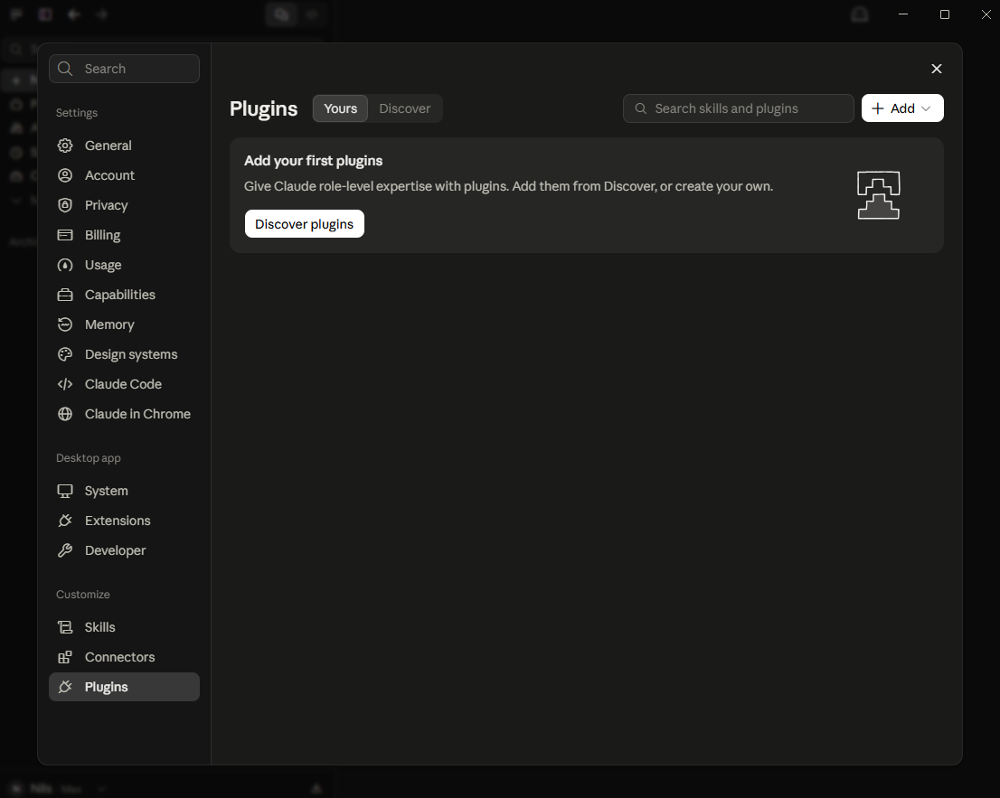
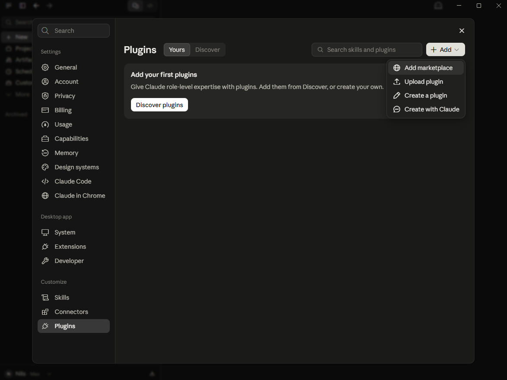
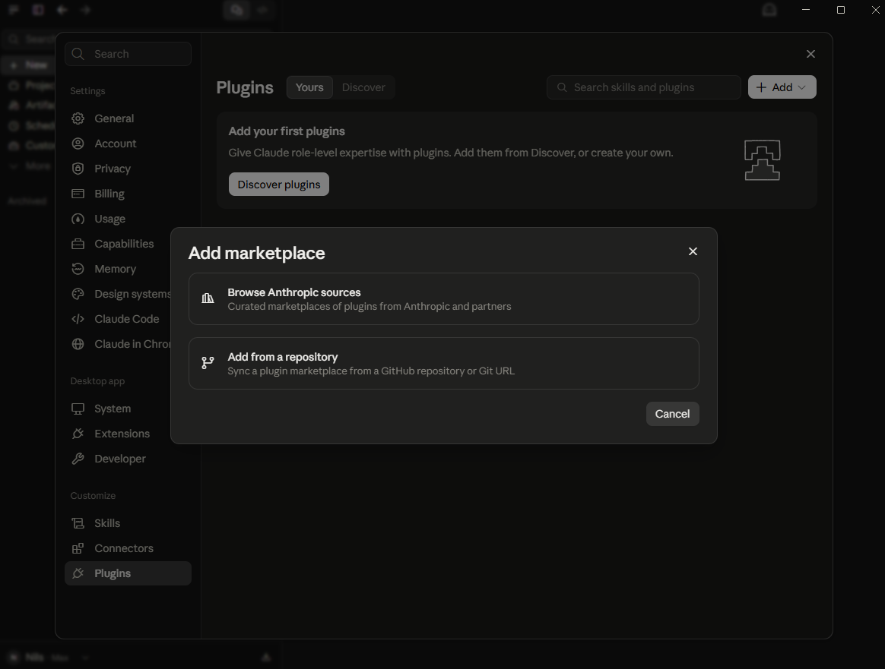
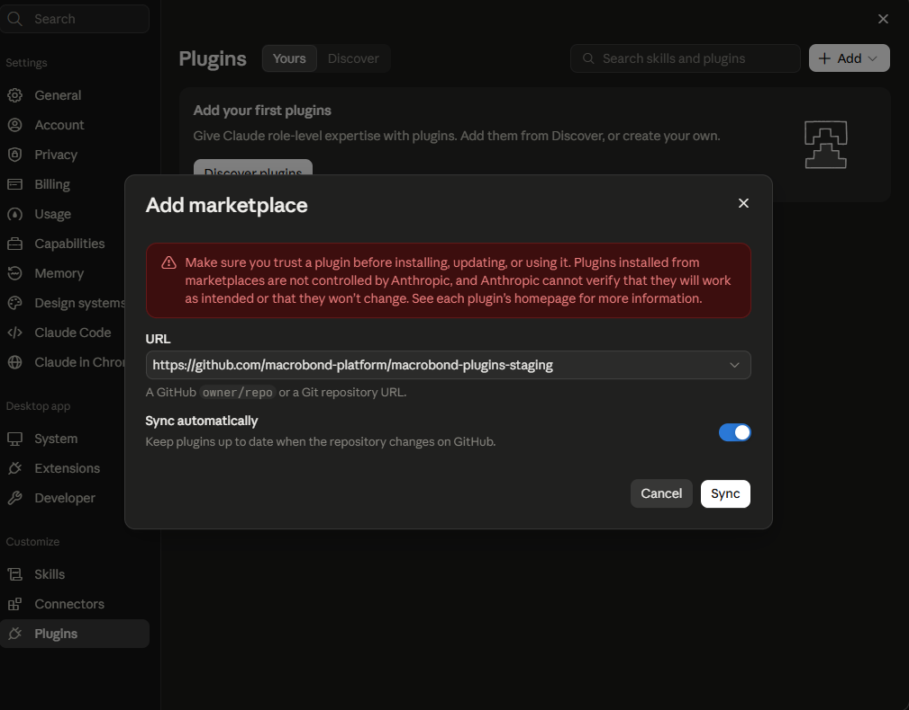
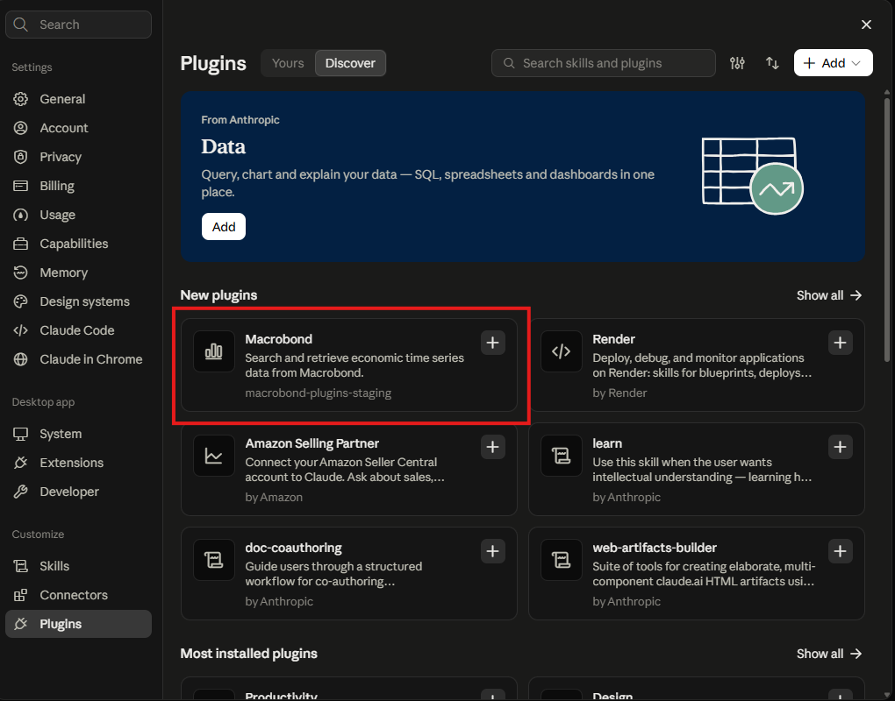
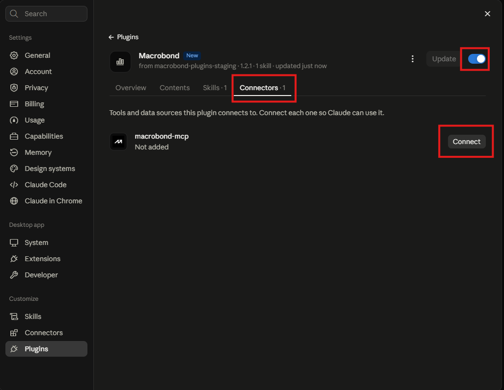
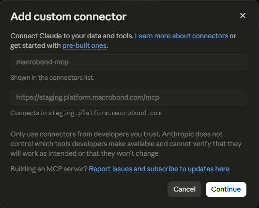
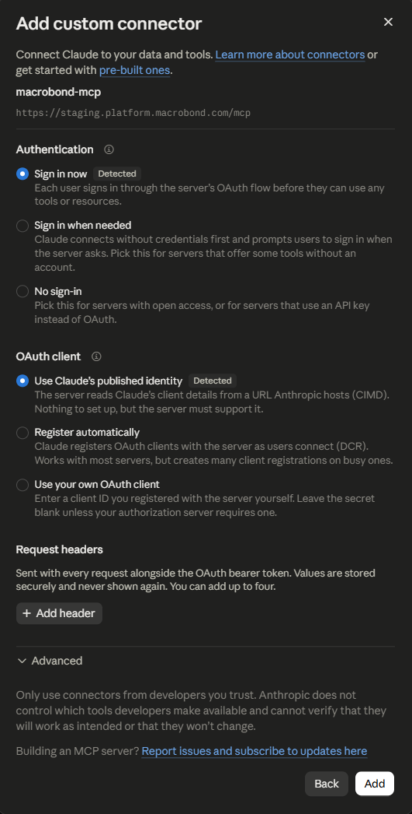
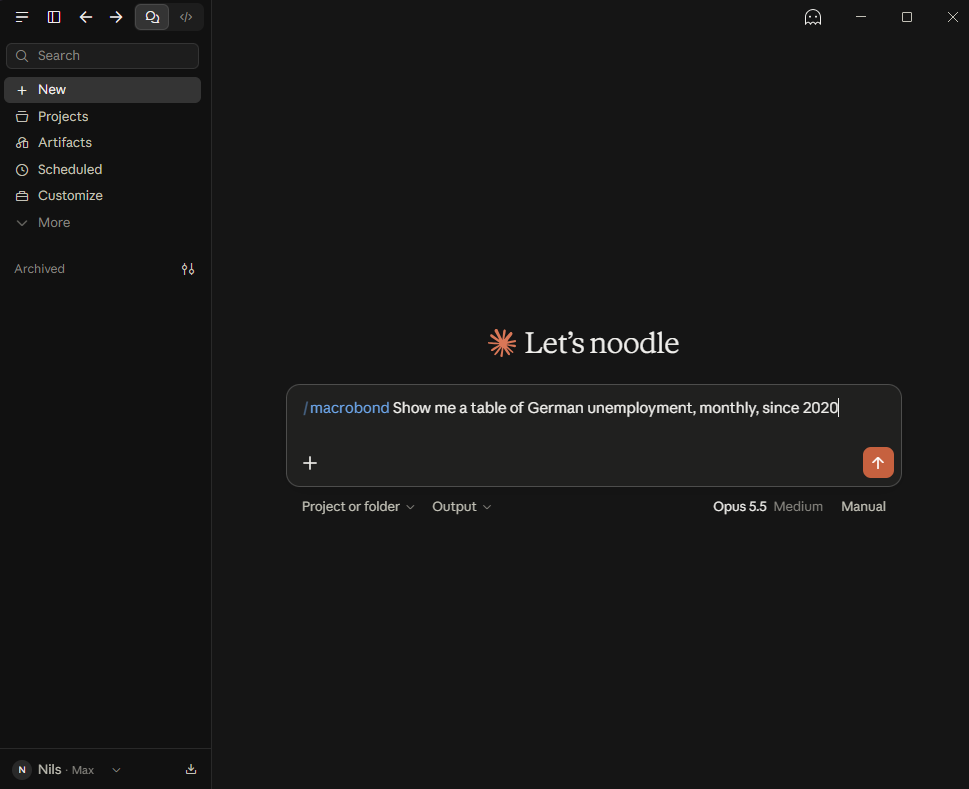

# Macrobond for Claude

Search and retrieve economic time series data from Macrobond. Use the plugin in
Claude Code, Claude chat, and Cowork.

This plugin includes the Macrobond skill and configures the hosted Macrobond MCP
service.

## Requirements

- An active Macrobond AI Data Feed subscription and a Macrobond account
- Claude Code, or access to plugins in Claude or Cowork

## Install

### Claude Code

```text
claude plugin marketplace add macrobond-platform/macrobond-plugins-staging
claude plugin install macrobond@macrobond-plugins
```

Restart Claude Code or run `/reload-plugins` after installation. Run `/mcp` to
open the connection panel and sign in to Macrobond.

### Claude chat and Cowork

1. Open **Settings** and select **Plugins**.

   

2. Select **Add**, then **Add marketplace**.

   

3. Select **Add from a repository**.

   

4. Enter `https://github.com/macrobond-platform/macrobond-plugins-staging` and select
   **Sync**.

   

5. Find **Macrobond** under **Discover** and add it.

   

6. Open the plugin, select the **Connectors** tab, and select **Connect**.

   

7. Select **Continue**. Keep the detected sign-in settings and select **Add**.

   

   

8. Sign in with your Macrobond account. Start a message with `/macrobond` to use
   the plugin.

   

Team and Enterprise owners can instead add the marketplace under
**Organization settings → Plugins** and make Macrobond available to their
organization.

## Connect your Macrobond account

When Claude prompts you to connect Macrobond, follow the sign-in flow and use your
Macrobond account.

## Try it

- *"Give me a chart of Sweden GDP."*
- *"Compare US and euro area core inflation over the last ten years."*
- *"Show me a table of German unemployment, monthly, since 2020."*

## Changelog

See [`CHANGELOG.md`](CHANGELOG.md).

## License

See [`LICENCE`](LICENCE).
