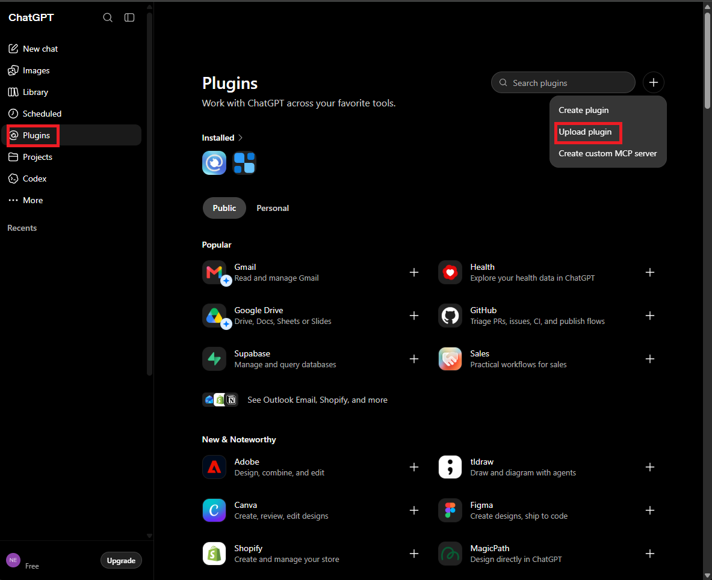
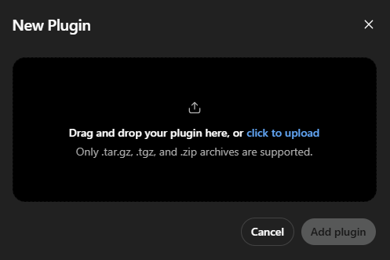
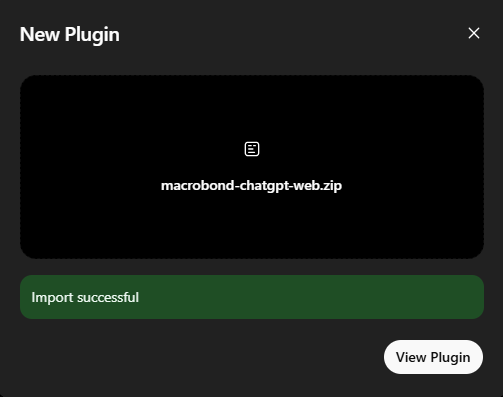
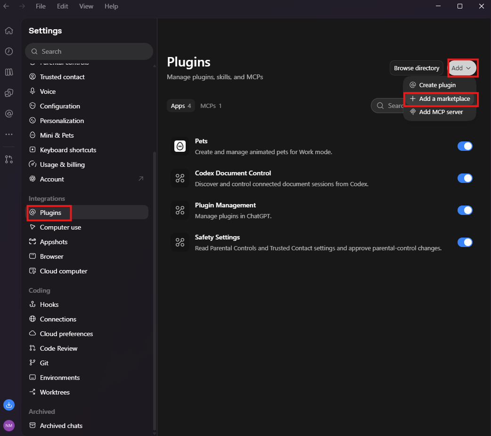
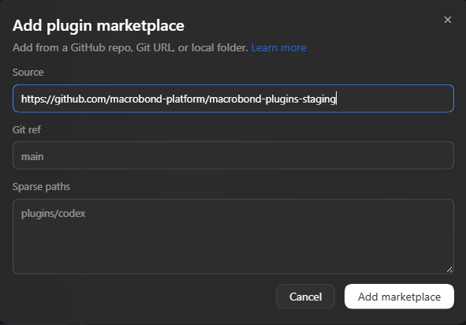
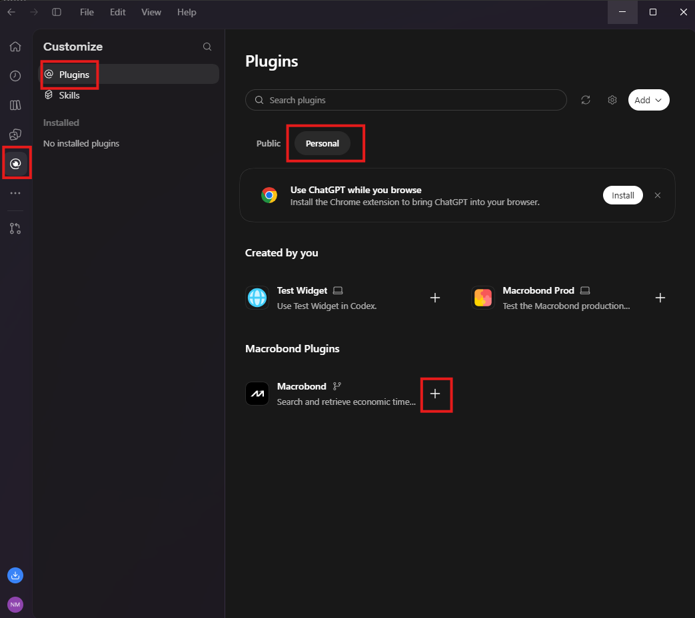
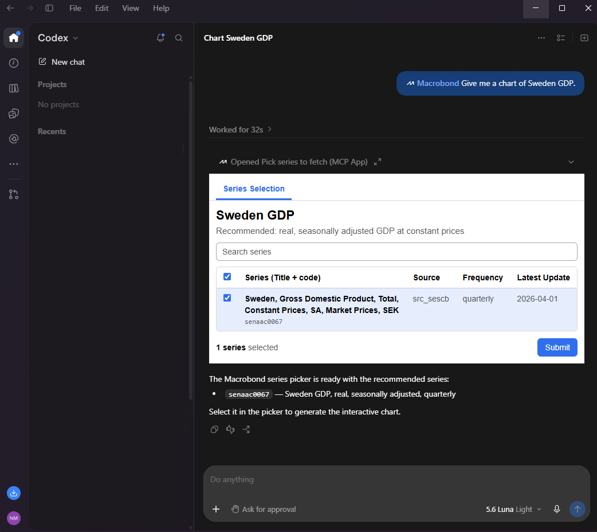

# Macrobond for ChatGPT and Codex

Search and retrieve economic time series data from Macrobond. Use the plugin in
Codex, or connect the hosted MCP service directly to ChatGPT.

The Codex plugin includes the Macrobond skill and configures the hosted Macrobond
MCP service.

## Requirements

- An active Macrobond AI Data Feed subscription and a Macrobond account
- Access to plugins in ChatGPT or Codex
- On ChatGPT web, the plugin works only in chats in the **Work** tab

## Install

### ChatGPT web

1. Download the
   [latest Macrobond ChatGPT plugin](https://github.com/macrobond-platform/macrobond-plugins-staging/releases/latest/download/Macrobond-AI-Data-Feed-ChatGPT-Web.zip).
   Do not unzip it.

2. Open **Plugins** in the sidebar. Select **+**, then **Upload plugin**.

   

3. Drag the downloaded ZIP into the window, or select **click to upload** and
   choose it.

   

4. When it shows **Import successful**, select **View Plugin**.

   

5. Sign in with your Macrobond account when prompted. Start a chat in the
   **Work** tab to use the plugin.

### ChatGPT workspace

A workspace administrator can make Macrobond available to workspace members:

1. Open **Admin → Plugins** and select **Add → Import marketplace**.
2. Enter `https://github.com/macrobond-platform/macrobond-plugins-staging` as the
   source and leave the marketplace path empty.
3. Select **Import marketplace** and authorize GitHub access when prompted.
4. Review the import results, open **Macrobond**, and configure its installation
   policy for the appropriate workspace roles.

The package currently configures the MCP service through `.mcp.json`, so an
imported workspace plugin is available in the ChatGPT desktop app rather than
ChatGPT on the web.

### ChatGPT desktop

1. Open **Settings** and select **Plugins**. Select **Add**, then
   **Add a marketplace**.

   

2. Enter `https://github.com/macrobond-platform/macrobond-plugins-staging` as the
   **Source** and select **Add marketplace**.

   

3. Open **Plugins** in the sidebar and select the **Personal** tab. Under
   **Macrobond Plugins**, select **+** next to **Macrobond**.

   

4. Sign in with your Macrobond account when prompted. Start a message with
   **Macrobond** to use the plugin.

   

   

### Codex CLI

Add the Macrobond marketplace and install the plugin:

```text
codex plugin marketplace add https://github.com/macrobond-platform/macrobond-plugins-staging.git
codex plugin add macrobond@macrobond-plugins
```

## Try it

- *"Give me a chart of Sweden GDP."*
- *"Compare US and euro area core inflation over the last ten years."*
- *"Show me a table of German unemployment, monthly, since 2020."*

## Changelog

See [`CHANGELOG.md`](CHANGELOG.md).

## License

See [`LICENCE`](LICENCE).
